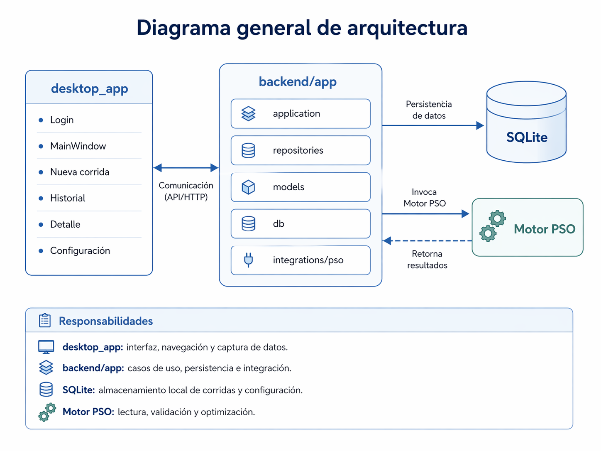
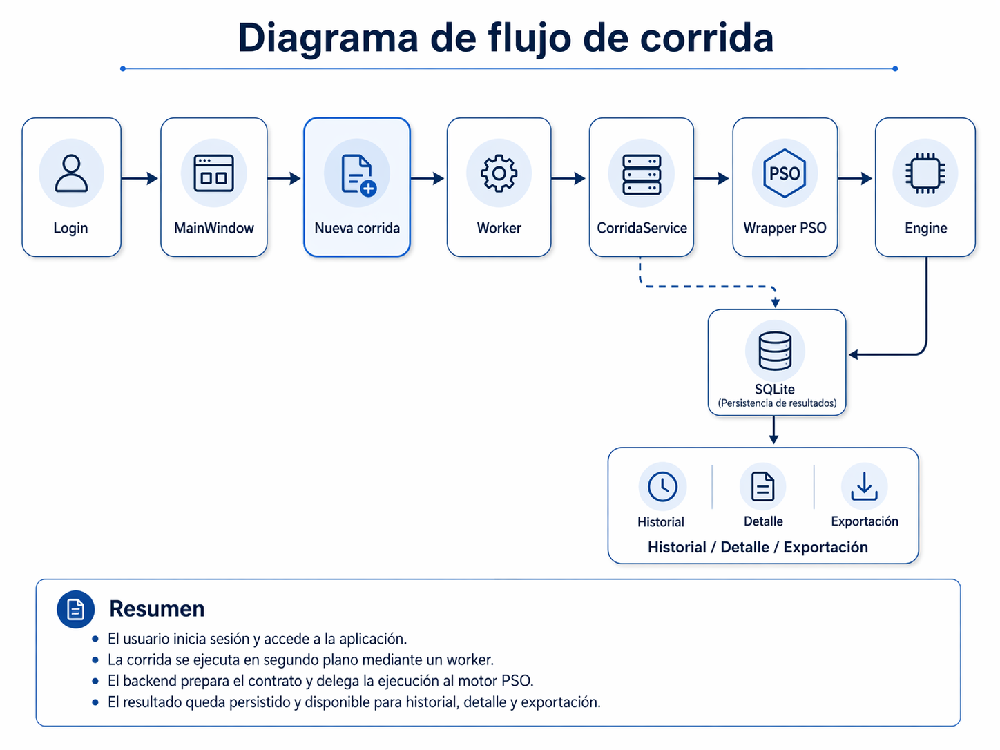

# Arquitectura técnica

## Diagrama general de arquitectura

### Aclaraciones

- `desktop_app` concentra la experiencia de usuario: login, navegación, formularios, historial, detalle y configuración.
- `backend/app` concentra la lógica del sistema: casos de uso, servicios, validaciones, acceso a datos y coordinación con el motor.
- `SQLite` almacena la información persistente del sistema, incluyendo corridas, usuarios y configuración.
- El `motor PSO` ejecuta la lógica de optimización y devuelve resultados que luego son persistidos y mostrados en la interfaz.

## Flujo de corrida

### Aclaraciones

- `Login` valida credenciales antes de abrir la aplicación principal.
- `MainWindow` actúa como contenedor de navegación de la aplicación.
- `Nueva corrida` recoge los datos del caso y dispara la ejecución.
- `Worker` ejecuta la corrida en un hilo separado para no bloquear la UI.
- `CorridaService` coordina el caso de uso de creación de corrida.
- `Wrapper PSO` adapta la entrada del sistema al contrato requerido por el motor.
- `Engine` ejecuta la optimización y genera resultados.
- `SQLite` persiste la corrida y su trazabilidad.
- `Historial`, `Detalle` y `Exportación` consumen la información persistida para consulta operativa.

## Extensiones futuras

Las siguientes capacidades están previstas en el roadmap, pero no forman parte del flujo base actual:

- carga manual,
- favoritos o casos base,
- reprogramación como servicio separado sobre el mismo contrato de entrada,
- scraping COES,
- alertas internas del sistema,
- alertas externas mediante mecanismos gratuitos,
- evaluación de infraestructura central,
- instalador formal y despliegue final.